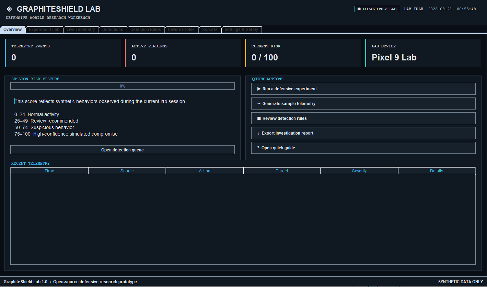
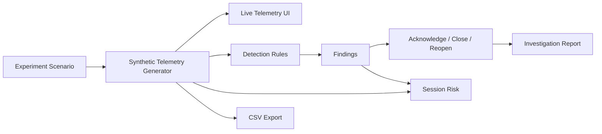

# GraphiteShield Lab

**A local-only Java desktop workbench for defensive mobile-threat behavior emulation, detection engineering, triage, and evidence reporting.**

[](https://openjdk.org/)
[](#requirements)
[](#safety-model)
[](LICENSE)

**Synthetic telemetry · Detection rules · Finding triage · Risk scoring · CSV export · HTML investigation reports**

---

## Overview

GraphiteShield Lab is a self-contained desktop research environment for safely demonstrating suspicious mobile-threat behavior and evaluating defensive detection logic.

The application generates **synthetic Android-style telemetry and identities** inside a local Java desktop interface. Researchers can run controlled scenarios, inspect event streams, test detection rules, triage findings, measure session risk, and export evidence without connecting to a real phone or external service.

The core workflow is:

**simulate → observe → detect → investigate → triage → report**

GraphiteShield Lab is designed for:

- blue-team demonstrations
- detection-engineering practice
- security education
- controlled threat-research exercises
- analyst workflow prototyping
- local defensive experimentation

It is intentionally **not** a spyware tool, exploitation framework, device-management utility, or real-device forensic collector.

---

## Screenshot

> Add your screenshot as `docs/images/graphiteshield-lab.png` using the instructions in [Adding the Screenshot](#adding-the-screenshot).

<p align="center">
  
</p>

<p align="center">
  <em>GraphiteShield Lab desktop research interface for synthetic telemetry, detections, experiments, rules, triage, and reporting.</em>
</p>

---

## Try It in Two Minutes

### Requirements

- Java **17 or newer**
- Windows, macOS, or Linux
- No external libraries or services required
- No network connection required for the included application

### Windows

Double-click:

```text
run-windows.bat
```

or from PowerShell:

```powershell
.\run-windows.bat
```

### macOS / Linux

Make the launcher executable once:

```bash
chmod +x run-linux-mac.sh
```

Then run:

```bash
./run-linux-mac.sh
```

### Direct JAR Launch

```bash
java -jar GraphiteShield-Lab.jar
```

The included launchers start the packaged JAR directly. No build process, package manager, external images, web services, or runtime downloads are required.

---

## Suggested First Experiment

For a quick tour of the full analyst workflow:

1. Open **Experiment Lab**
2. Choose **Combined advanced intrusion simulation**
3. Set playback speed to **2×**
4. Click **Run experiment**
5. Open **Live Telemetry**
6. Search and filter the generated events
7. Review findings under **Detections**
8. Acknowledge or close a finding
9. Open **Detection Rules**
10. Test a rule manually
11. Open **Reports**
12. Generate the HTML investigation report

That provides a complete end-to-end demonstration using synthetic data only.

---

## What GraphiteShield Lab Demonstrates

GraphiteShield Lab combines multiple defensive-security workflows in one desktop application:

- synthetic mobile-threat behavior emulation
- event/telemetry generation
- analyst-oriented filtering and inspection
- configurable detection logic
- finding lifecycle management
- risk scoring
- evidence export
- investigation reporting
- controlled scenario playback
- safe research boundaries

The project is intentionally designed around the **defender's workflow**, not attacker capability.

---

## Main Capabilities

### Experiment Lab

The application includes seven controlled experiment scenarios designed to generate suspicious-but-synthetic behavior patterns.

Experiments can be replayed at adjustable speed so analysts can observe how event sequences evolve over time.

The scenario system is useful for:

- demonstrations
- rule evaluation
- analyst training
- UI testing
- repeatable defensive exercises

---

## Live Synthetic Telemetry

GraphiteShield Lab generates a live event stream during experiments.

Analysts can:

- search telemetry
- filter by severity
- sort events
- inspect event details
- follow an experiment as it progresses

All telemetry is generated locally by the simulator.

No real device events are collected.

---

## Detection Rules

Detection logic can be reviewed and tested inside the application.

The rule workflow supports defensive experimentation around suspicious behavior patterns without executing real malicious activity.

This allows a researcher to compare:

```text
Synthetic behavior
       ↓
Generated telemetry
       ↓
Detection rule
       ↓
Finding
       ↓
Analyst triage
```

---

## Finding Triage

Detected events are turned into analyst-reviewable findings.

The application supports finding lifecycle actions including:

- acknowledgement
- closure
- reopening

This makes GraphiteShield Lab useful for demonstrating the workflow around detection—not just generating alerts.

---

## Risk Scoring

GraphiteShield Lab calculates session-level risk so experiment results can be viewed as a larger investigation rather than only as individual events.

The dashboard provides a quick summary of the simulated environment and current defensive posture.

Risk values are demonstration aids and should not be interpreted as production threat scores.

---

## Synthetic Device Profiles

The application includes multiple synthetic Android-style device profiles.

Profiles exist only to provide realistic context for experiments.

They do not correspond to or communicate with actual phones.

---

## Reporting and Evidence Export

### CSV Telemetry Export

Generated telemetry can be exported to CSV for:

- offline review
- spreadsheet analysis
- documentation
- training exercises
- rule-development comparisons

The generated telemetry export is intentionally ignored by Git through:

```text
graphiteshield-telemetry.csv
```

### HTML Investigation Report

GraphiteShield Lab can generate a styled HTML investigation report that summarizes the simulated session and analyst findings.

The generated report file is also excluded from source control:

```text
graphiteshield-report.html
```

This keeps generated analyst artifacts separate from application source.

---

## Architecture

GraphiteShield Lab is intentionally self-contained.



No external device, server, API, or database is required for the included lab workflow.

---

## Repository Layout

```text
GraphiteShield_lab/
├── src/
│   └── GraphiteShieldLab.java
├── GraphiteShield-Lab.jar
├── run-windows.bat
├── run-linux-mac.sh
├── README.md
├── LICENSE
└── .gitignore
```

The repository currently includes both source and a directly runnable JAR so the project can be evaluated without compiling it first.

---

## Build From Source

GraphiteShield Lab is written in Java and targets Java 17 or newer.

From the repository root, a basic build can be performed with the JDK:

```bash
mkdir -p build
javac -d build src/GraphiteShieldLab.java
```

Run the compiled class:

```bash
java -cp build GraphiteShieldLab
```

To create an executable JAR manually:

```bash
jar --create \
    --file GraphiteShield-Lab.jar \
    --main-class GraphiteShieldLab \
    -C build .
```

On Windows Command Prompt, the same operations can be performed using the installed JDK's `javac`, `java`, and `jar` commands.

---

## Technology

| Area | Implementation |
|---|---|
| Language | Java |
| Minimum runtime | Java 17 |
| Application type | Desktop |
| UI | Java desktop/Swing-style interface |
| Persistence | Local in-memory/session workflows |
| Telemetry | Synthetic/local |
| Reporting | CSV + standalone HTML |
| External services | None required |
| Real-device integration | None |

---

## Safety Model

GraphiteShield Lab is intentionally a **defensive simulator**.

It does **not**:

- contain or deliver exploits
- exploit mobile devices
- connect to phones
- use ADB
- install software on devices
- open command-and-control connections
- collect real messages
- collect credentials
- collect real location data
- access microphones or audio
- access cameras
- collect contacts
- collect files from a real device
- transmit synthetic telemetry to an external server
- provide persistence or evasion mechanisms for malware

Network addresses used in scenarios are documentation/test fixtures rather than operational infrastructure.

All identities, device information, telemetry, findings, and threat events are synthetic.

---

## Why the Safety Boundary Matters

Mobile-threat research can easily become ambiguous if a demonstration tool interacts with real systems.

GraphiteShield Lab intentionally keeps the boundary clear:

```text
Research behavior model
        ↓
Synthetic experiment
        ↓
Synthetic telemetry
        ↓
Defensive detection
        ↓
Analyst investigation
```

There is no step that connects the simulator to a real target.

That makes the project appropriate for education, demonstrations, detection engineering, and controlled defensive research.

---

## Generated Files and Repository Hygiene

The current `.gitignore` excludes:

```text
build/
*.class
*.log
graphiteshield-telemetry.csv
graphiteshield-report.html
```

This keeps:

- compiler output
- runtime logs
- analyst exports
- generated reports

out of version control.

---

## Project Status

GraphiteShield Lab is a defensive-security portfolio and research project.

It currently demonstrates practical work across:

- Java desktop development
- event-driven UI workflows
- synthetic telemetry generation
- detection engineering
- rule evaluation
- analyst triage
- security UX
- data filtering
- risk scoring
- CSV export
- HTML reporting
- cross-platform packaging
- explicit defensive safety boundaries

---

## Current Limitations

GraphiteShield Lab is not intended to be a production mobile EDR, forensic suite, or commercial malware-analysis platform.

Current scope does not include:

- real Android device acquisition
- ADB integration
- APK analysis
- packet capture
- dynamic sandboxing
- external threat-intelligence feeds
- cloud synchronization
- multi-user case management
- production identity/RBAC
- enterprise evidence-chain management

These are deliberate boundaries unless the project evolves toward additional **defensive-only** research workflows.

---

## License

GraphiteShield Lab is released under the [MIT License](LICENSE).

---

## Author

**Daniel Fuhr**

- GitHub: [github.com/fuhrdan](https://github.com/fuhrdan)
- LinkedIn: [linkedin.com/in/danielfuhr](https://www.linkedin.com/in/danielfuhr/)
- Portfolio: [lakehousesoftware.com](https://lakehousesoftware.com/)

---

## Why This Project Matters

GraphiteShield Lab demonstrates the intersection of **software engineering, defensive security, detection logic, analyst workflow design, and safety-conscious research tooling**.

Rather than claiming to detect or interact with real spyware, the project creates a controlled environment where suspicious behavior can be modeled, detected, investigated, and documented without exposing real devices, real users, or real data to risk.

That defensive end-to-end workflow is the core of the project.
